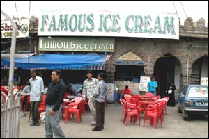

+++
title = 'Hyderabad Foods'
date = 2025-04-08T07:18:08+05:30
draft = false
tags = [""]
Categories = [""]
+++

hello **bhojana priyulara**  😂, i am making the blog for food lovers who are at hyderabad, in this blog i will mention few places and few dishes which are famous in Hyderabad which you need definately try it atleast once in your life.

note this blog may update time to time, if you know few famous places & dishes you can email us about that particular place email : **mickelbasha1268@gmail.com**

---

### **Bawarchi Biriyani**
- **Hyderabadi Biryani** – You may have heard that Hyderabad is famous for its Hyderabadi Dum Biryani. I highly recommend trying **Bawarchi Biryani** near RTC Cross Roads – it's a must-visit! You can find it on the map [here](https://www.google.com/maps/place/Bawarchi+Restaurant/@17.4066074,78.4938271,15.96z/data=!4m6!3m5!1s0x3bcb99eab388910b:0x7c7c5b397008290!8m2!3d17.406627!4d78.4976861!16s%2Fg%2F1td4sr1c?entry=ttu&g_ep=EgoyMDI1MDQwMi4xIKXMDSoJLDEwMjExNjM5SAFQAw%3D%3D). 

- **What to try:** Apart from the biryani, don’t miss the snacks – the **shawarma**, **broasted chicken**, and **fish** are amazing too! You can easily get a full meal for around **₹300**.

- **Bonus tip:** Right beside Bawarchi, there’s **Sandhya Theatre**, You can plan a movie after your meal and make it a perfect outing!

---

### **Shah Ghouse**
- Shah Ghouse has several branches across Hyderabad, and it's one of the most popular spots for non-veg lovers. The **mutton**, **chicken majestic**, and **garlic chicken** are especially tasty and come at an **affordable price**. Definitely worth a visit if you’re craving some spicy and flavorful dishes!

---

### **Alkabar Cafe**
- **Alkabar Cafe** is located near **Charminar**, and it’s a great spot for a quick and satisfying bite while you're exploring the area. You can navigate to it by clicking [this link](https://g.co/kgs/ZQ1goUs). They serve tasty **burgers** and **sandwiches**, both priced around **₹100** – definitely worth the money!

- In addition, they also offer **French fries** and **broasted chicken**, which come at a **slightly higher price** but are equally delicious. If you're visiting Charminar, don’t miss giving this place a try!

---

### **Uday Restaurant**
- **Uday Restaurant** is a hidden gem located near **Abids**, known for its **low prices** and **great quality food**. You can find it on the map [here](https://maps.app.goo.gl/Z1JbmyeUZcGFmZNC8). They serve delicious **biryani**, **chicken 65**, and soft **butter naan & roti** – all full of flavor!

- It’s one of the **oldest restaurants** in the area, and a great spot to enjoy a tasty meal without burning a hole in your pocket. Definitely worth a visit when you're around Abids.

---

### **DLF Street Food**
- **DLF Street Food** is one of the most famous street food spots in **Gachibowli**. You can check the location [here](https://maps.app.goo.gl/3sfUUtBF21JR7kgS8). The area is packed with popular stalls, and if you love street food, this place is a must-visit!

- One of the must-tries is the **shawarma** from one of the well-known stalls. If you have **time and budget**, explore as many stalls as you can – each one has its own unique taste and vibe!

---

### **Sarvi Restaurant**
- **Sarvi Restaurant** is one of the top-rated places in Hyderabad for **delicious biryani** and is highly recommended for food lovers. You can check the location [here](https://maps.app.goo.gl/zwxPPt9UcXbX6JT66). 

- Their biryani is known for its **rich flavor and aroma**, making it a must-try at least once if you're in the city. A perfect spot for a satisfying meal!

---

### **Milan Juice Center**
- **Milan Juice Center** is located near **Charminar** and is well-known for its wide variety of **juices** and **ice creams**. You can check the location [here](https://maps.app.goo.gl/SSWeyckFL9wQXEEZA).

- While the prices here are a bit on the **higher side**, the **quality and taste** make it totally worth it. If you're in the Charminar area, this place is **highly recommended** for a refreshing treat!

---

### **Mr. Milton Kitchen**
- **Mr. Milton Kitchen** is a great spot for meat lovers, especially known for its **flavorful mutton biryani** and **mouth-watering mandi**. You can find the location [here](https://maps.app.goo.gl/F15zGjMGQAFWwc536).

- The taste is so good, you’ll probably find yourself **coming back for more** after just one visit. Definitely a place you should try if you’re nearby!

---
### **Cafe Bahar**
- **Cafe Bahar** is a legendary spot in Hyderabad, and if you’re a fan of biryani, you **cannot miss** their **Fish Dum Biryani** – it’s the **highlight** here! You can check the location [here](https://maps.app.goo.gl/ze3Z686yfc58D55v5).

- Other dishes are great too, but the **Fish Dum Biryani** is on another level – *worth varma, worth worthu*! 😄 A must-try for sure!

---

### **Taaza Point, Balapur**
- **Taaza Point** in **Balapur** is a great spot if you're craving a tasty and budget-friendly **dosa**. You can check the location [here](https://maps.app.goo.gl/6t6fZqqigbp4r7FN9).

- Their dosas are **big in size**, **rich in taste**, and come at **low prices**, making it a perfect place for a quick and satisfying meal. Definitely worth checking out!

---

### **Famous Ice Cream – Nampally**

- Located in **Nampally**, **Famous Ice Cream** is not just about the ice cream – it’s about the **whole experience**. Check the location [here](https://maps.app.goo.gl/XsDLDY43CUx3HYmE7).

- The place has a **historical charm**, built with **stone walls**, and sits right in the **middle of traffic hustle**, yet offers a surprisingly **peaceful vibe**. There’s a **large outdoor seating area**, cool **grass-covered tables**, and lovely **lighting** at night – perfect for all kinds of visitors.

- With a **wide variety of ice creams** and plenty of space, it’s a chill spot to hang out, even if there’s a bit of noise around. Totally worth a visit!

---

### **Aqeeq Restaurant (Cafe 555)**
- Located in **Masab Tank**, **Aqeeq Restaurant**, also known as **Cafe 555**, is an **iconic spot**, especially during the **Ramzan season**. Check the location [here](https://maps.app.goo.gl/c3DUELRsLS4Aueg3A).

- It’s **Hyderabad’s No.1 spot for haleem** during Ramzan — so popular that **celebrities** often drop by, and the place gets **super crowded at night**. 

- Apart from haleem, their **Double Gosht Mutton Biryani** priced around ₹600 is absolutely **worth every rupee** – rich in flavor, perfectly cooked meat, and just unforgettable. You **must try it once** if you’re in the city during the festive season!

---
