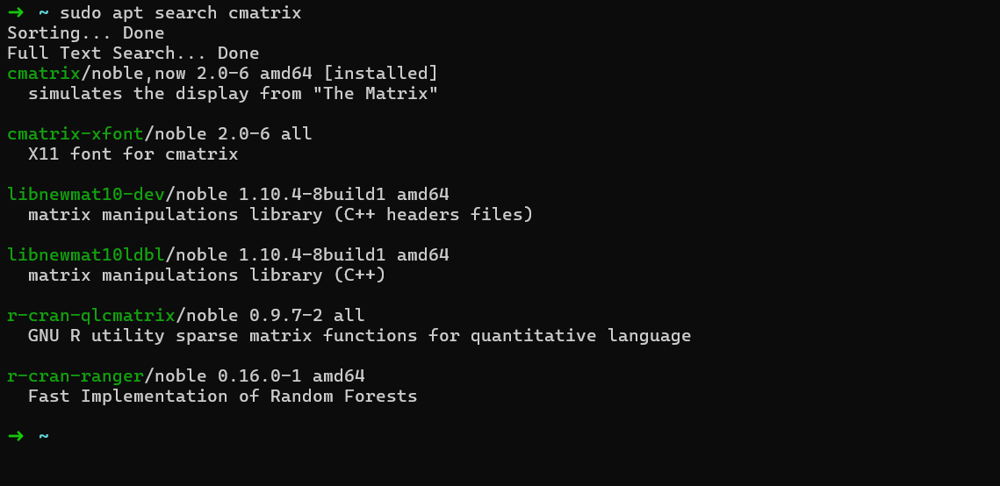

+++
title = 'Install Software in Linux'
date = 2025-09-30T05:48:42+05:30
draft = false
tags = [""]
Categories = [""]
+++

After reading my content some of my friends asked me about how to install software in linux 
in this article i will show you how to install software in linux 

## beginner level
let me just explain in nood level 

suppose i need to install **gimp** its famouse image editor software just like photoshop 

first you need to open the *terminal* by pressing ``ctrl + alt + t`` or by searching on the app list/ app drawer 

```
sudo apt install gimp -y
```

Boom! thats it your image editing software is just installed 

### technically 
the APT package manager which is piece of software which is help to install the software so just use it 

if you want to install other software like cmatrix 

first search for it like if it exists or not after that use that code word 

```
sudo apt search cmatrix
```


luckily i have in the search list 

so i just install it via 

```
sudo apt install cmatix
```

so you need to do 
1. search 
2. install 

## ultra beginner

let me guess you want like **play store** / **windows store**

for that you need to install ```synaptic```

in terminal 

```
sudo apt install synaptic -y
```

and 

```
sudo synaptic
```

you can see the GUI interface to easy to install software 

## how to install google chrome 

Google chrome is one of software which is not listed in the apt package manager for that you need to insatll it from out side or office google chrome website 

here i am going to show office method 

```
wget https://dl.google.com/linux/direct/google-chrome-stable_current_amd64.deb
```

once you have download the deb file stay in the current directory 

```
sudo dpkg -i google-chrome-stable_current_amd64.deb
```

if you notice errors to fix that 

```
sudo apt --fix-broken install
```

again try 

```
sudo dpkg -i google-chrome-stable_current_amd64.deb
```

thats it very simple! 

## how to uninstall software 

You should also know how to uninstall software if you do need it and free your space 

```sudo apt --purge remove <software name>```

example you need to uninstall google chrome 

```
sudo apt --purge remove google-chrome-stable
```

thats it simple !

## intermediate level 

> i am tell you this for your educational purpose i recommend to not to use 

there are not only the package manager software like apt there are so many similar to apt 
1. snap
2. flatpack
etc 

but as debian/ubuntu user just use APT fo best use case 

just read those things via 

in terminal 
```
man snap

or 

man flatpack
```

there is even snap or flatpack stores just like synaptic for apt but 

```i dont recommend them``` because snap and flatpack may spoil the system fastness especially if you install ubuntu in low end devices it makes worst so better skip this 

## hard level 

the hardest level of installing software no body uses this level exect deverlopers or software engineers or technical guys 

- this level includes installing the software from ``source code `` 

most of the software doesnt provide source code but this is linux you need to deal with open source software so most of things are written in C/C++ so you need to make sure the ``make`` software installed to build the software and install it from source code 

ha thats head ach method every software developer will give instructions to install it from source code so it varies according to the software **so if your begineer just skip it **

## thanks 
yeah if your reading this end of the page then your very curious about linux 

so my friends follow the [beginner-level](#beginner-level) and [ultra-beginner](#ultra-beginner) to make your life better and easy thank you hope you like it 

i think i made this article simpler and easy to understand i like to hear your feed backs i am open to listen those 
you can just email me here [mickelbasha1268@gmail.com](mailto:mickelbasha1268@gmail.com)

Asthala vistah baby ! 


Got it — that means even after reinstalling `dpkg`, the **`start-stop-daemon` binary is still missing or not properly linked in your system’s PATH**.
Let’s fix it step by step carefully 👇

---

### 🧩 Step 1: Confirm which Linux version you are using

Run this command:

```bash
lsb_release -a
```

or (if that doesn’t work)

```bash
cat /etc/os-release
```

Tell me what it shows — it helps know whether it’s **Ubuntu**, **Debian**, or **something else** (since the fix slightly differs).

---

### 🧰 Step 2: Check if the file exists anywhere

Run:

```bash
sudo find / -name start-stop-daemon 2>/dev/null
```

If it shows a path like `/usr/sbin/start-stop-daemon`, then it just isn’t in your PATH.

In that case, create a symbolic link:

```bash
sudo ln -s /usr/sbin/start-stop-daemon /sbin/start-stop-daemon
```

Then check:

```bash
ls -l /sbin/start-stop-daemon
```

You should now see the link pointing correctly.

---

### 🧠 Step 3: If it’s not found anywhere

Then reinstall from the base system package:

```bash
sudo apt-get update
sudo apt-get install --reinstall dpkg dpkg-dev
```

If that still doesn’t work, manually download the correct package for your system architecture:

For example (on Ubuntu 22.04 amd64):

```bash
wget http://archive.ubuntu.com/ubuntu/pool/main/d/dpkg/dpkg_1.21.1ubuntu2.3_amd64.deb
sudo dpkg -i dpkg_1.21.1ubuntu2.3_amd64.deb
```

*(Replace the version based on your distro — I can help you get the exact URL if you tell me your OS.)*

---

### ✅ Step 4: Test again

Once done:

```bash
which start-stop-daemon
```

and

```bash
sudo dpkg --configure -a
```

Then retry Chrome installation:

```bash
sudo dpkg -i google-chrome-stable_current_amd64.deb
```

---

Can you please share the output of

```bash
cat /etc/os-release
```

so I can give you the exact package URL or command for your system?
