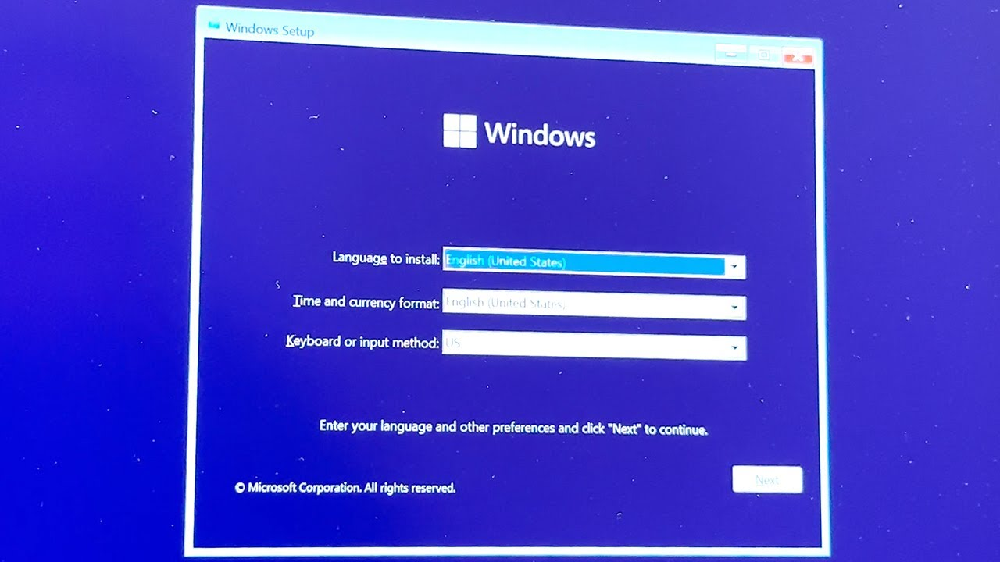

+++
title = 'WindowPE'
date = 2026-06-27T11:00:35+05:30
draft = false
tags = [""]
Categories = [""]
+++

# Windows PE (Preinstallation Environment)

## What is Windows PE?

Windows PE (Preinstallation Environment) is a lightweight version of Windows that loads during the boot process when installing, deploying, or repairing a Windows operating system.

You can think of Windows PE as a mini operating system that is included inside every Windows installation ISO. When you boot from a Windows installation media, Windows PE starts first before the actual Windows Setup or operating system loads.

For example, when you see the Windows installation screen like the one below, you are already running Windows PE.



---

## How Does Windows PE Work?

Technically, when a system boots from a Windows installation media:

1. Windows PE boots first.
2. Windows Setup launches from within Windows PE.
3. The main Windows operating system is installed or loaded afterward.

---

## Why is Windows PE Useful?

Windows PE can be extremely helpful for troubleshooting and recovery tasks:

* Repair corrupted Windows system files.
* Access files when Windows fails to boot.
* Use command-line tools such as:

  * `diskpart`
  * `sfc`
  * `chkdsk`
  * `bootrec`
* Open Notepad for quick edits.
* Browse files using File Explorer (if added to the PE image).
* Perform system diagnostics and recovery operations.

---

## Creating a Windows PE ISO

### Step 1: Install Required Components

Download and install the following:

* ➜ [Windows ADK (Assessment and Deployment Kit)](https://learn.microsoft.com/en-us/windows-hardware/get-started/adk-install)
* ➜ Windows PE Add-on for ADK 

---

### Step 2: Open Deployment Tools Command Prompt

Open:

**Deployment and Imaging Tools Environment**

or

**Deployment Tools Command Prompt** (depending on your ADK version).

---

### Step 3: Create a Working Windows PE Directory

Run the following command:

```cmd
copype amd64 C:\WinPE
```

This creates a working directory containing all the files required to build a Windows PE image.

---

### Step 4: Create the ISO File

Run:

```cmd
MakeWinPEMedia /ISO C:\WinPE C:\WinPE\WinPE.iso
```

After the process completes, your Windows PE ISO file will be generated.

🎉 That's it! You have successfully created a Windows PE ISO.

---

## Creating a Bootable USB Drive

Once the ISO is created, you can use tools such as:

* Rufus
* Balena Etcher

to create a bootable USB drive.

Simply select the ISO, choose your USB drive, and start the flashing process.

After that, boot your system from the USB drive and start using Windows PE.

---

## Important Note

By default, the Windows PE image you create contains a simple Command Prompt environment. When booted, it opens directly into a terminal window.

From there, you can run various commands for:

* Troubleshooting
* Diagnostics
* Disk management
* File recovery
* System repair

You can also customize Windows PE further by adding drivers, scripts, tools, and additional applications.

---

## Download Ready-Made Windows PE ISO

If you don't want to go through the entire creation process, I have already created a Windows PE ISO.

➜ **Download Windows PE ISO**  [link](https://mega.nz/file/ESlFQAxb#j2jfr_WiCwrzLKjewi8SKU9NuFpY2vviXiTQot9tBVg)

After downloading, use Rufus or Balena Etcher to create a bootable USB drive and boot from it.